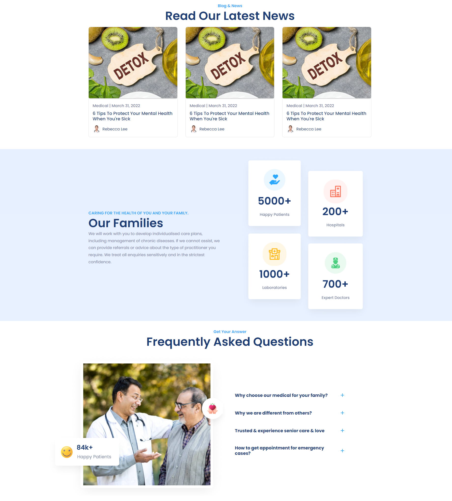
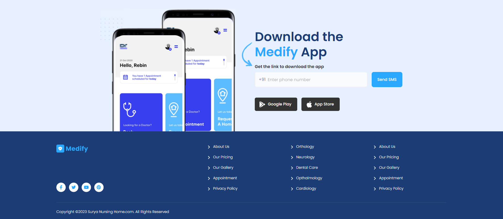

MEDIFY - Medical Center Slot Booking Platform
Medify is a medical center slot booking platform that allows patients to book appointments with doctors and medical specialists

Key Features :

Landing Page:
A top navigation bar with access to platform sections such as Find Doctors, Hospitals, Medicines, and more.
A search section for users to select a state and city, leading to a list of available medical centers in the chosen area.

Booking Interface:
A detailed booking section for users to select a medical center, with a calendar-like interface to choose an appointment date.
The ability to book an appointment within a time frame from today up to one week in advance.
A selection of available time slots for the selected day.

Available hospitals in the city:

My Bookings Page:
A personalized page displaying all user bookings, including details such as the medical center's name, appointment date, and time.

